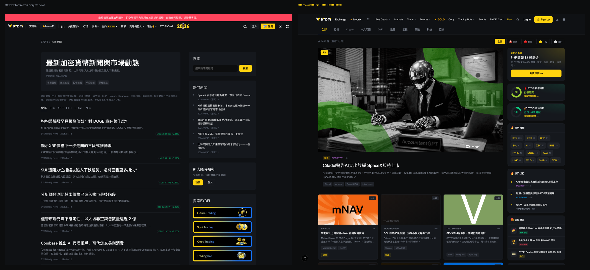

# Crypto News 產品原型 — 前端交付與評估文件

> 給 BYDFi 前端團隊評估:**這份原型能否移植進 `bydfi-ssr`,取代目前的 `https://www.bydfi.com/zh/crypto-news`。**

---

## 0. 一句話定位

這是一個**功能遠比現有 `/zh/crypto-news` 豐富的加密新聞產品原型**(可運作、有真實數據),用來證明產品設計、資料模型與 SEO/GEO 策略。
**它是「參考實作 / 規格」,不是「可直接上線的生產代碼」** — 因為它用的是 App Router + SQLite + Python 管線,需要照著移植到 bydfi-ssr 的架構。

---

## 1. 怎麼快速看到效果(評估第一步)

```bash
# 前端(已有預先收集好的 data/hotspots.db,可直接看)
cd frontend && npm install && npm run dev   # → http://localhost:3001/news

# 後端資料管線(可選,更新數據)
pip install -r requirements.txt
bash scripts/refresh.sh                      # 抓取→分類→補圖→AI改寫→指數計算
```

**建議**:部署一份到 Vercel/內網,或錄一段操作影片給同事,比讀代碼快 10 倍。
重點看這幾頁:`/news`、文章頁、`/coin/BTC`、`/dip-index`、`/top-signal`、`/news/markets`。

---

## 2. 功能清單(vs 目前 `/zh/crypto-news`)

| 功能 | 本原型 | 目前 crypto-news |
|---|---|---|
| 多源新聞聚合(88+ 來源) | ✅ | 部分 |
| AI 摘要 / 熱詞 / **原創改寫**(DeepSeek) | ✅ | ❌ |
| 焦點 Hero + 圖文卡片 + 側欄(熱門幣/熱門排行/24-7快訊/活動/CTA) | ✅ | 基本列表 |
| **幣種聚合頁** `/coin/[幣]`(新聞+價格+直連 BYDFi 交易) | ✅ | ❌ |
| **BYDFi 抄底指數 / 逃頂指數**(原創複合指標 + 歷史圖 + 回測) | ✅ | ❌ |
| 行情榜(BYDFi 可交易幣對,抄底/領漲) | ✅ | ❌ |
| 站內搜尋 | ✅ | ? |
| **SEO/GEO**:SSR、關鍵字 slug、Article/Dataset/Breadcrumb schema、sitemap | ✅ | 需確認 |
| 多語系 /zh /en + hreflang | 🔸 目前偏單語(中) | ✅(生產線已有) |

> 取代與否的核心問題不是「夠不夠好」,而是「**新增的這些(幣種頁、原創改寫、抄底指數)值不值得移植**」。

---

## 3. 技術棧 與 移植對照表(前端同事重點)

| 層面 | 本原型 | bydfi-ssr 對應(需移植) |
|---|---|---|
| 框架 | Next 16 **App Router** | Pages Router `.page.tsx` |
| 樣式 | **styled-jsx**(每個元件內嵌 CSS) | 改成他們的樣式系統 |
| 資料讀取 | `lib/db.ts` 直連 **SQLite**(better-sqlite3) | 改成他們的 **SSR 資料層 `Http.getXxx`** |
| 頁面組裝 | React 元件直接 import | 可能要對映 `componentMap` / `serverComponentsMap`(見前端同事的 `bydfi-codegen-ssr-sidebar-pick` skill) |
| 設計 tokens | 已用 BYDFi 色票(`--skin-primary-color` 等) | ✅ 幾乎直接通用 |
| 元件 | 18 個(`frontend/components/`) | 邏輯/結構可參考,樣式需轉換 |

**可直接借鏡(不需大改)**:UI/UX 設計、資料模型、SEO 結構(schema/slug/sitemap)、業務邏輯(抄底指數公式、幣種比對、AI 提示詞)。
**需要重做(基建)**:styling、資料層、頁面路由。

---

## 4. 資料模型 — 後端要產出的東西(給後端/平台團隊)

前端只是消費端;真正要長期跑的是**資料管線**。後端要提供:

**主資料表 `hotspots`(23 欄)**:
`id, title, content, fulltext, url, source, category, published_at, importance, summary, summary_zh, keywords, symbols(BYDFi 幣對), image_url, article_md(AI 改寫全文), article_title, ...`

**指標 JSON 檔(每次刷新產生)**:
`dip_index.json` / `top_index.json`(+ 歷史)、`coin_prices.json`、`fear_greed.json`、`onchain.json`(MVRV-Z/NUPL)、`bydfi_symbols.json`(BYDFi 可交易幣對,來自 BYDFi sitemap)、`btc_daily.json`(回測用)。

**管線腳本** `scripts/`(每 2h 跑 `refresh.sh`):
抓取(`collect_trend`)→ 入庫去重 → 分類 → 補圖/全文 → **DeepSeek 摘要+改寫**(`enrich_ai`/`enrich_rewrite`,需 API key)→ 指數計算(`compute_dip_index`/`compute_top_index`)。

> ⚠️ **這半部前端團隊接不了** — 需要後端/平台把它服務化(排程 + DB/CMS + DeepSeek 金鑰 + 對前端的 API)。這是「能否取代」最關鍵的依賴。

---

## 5. SEO/GEO 規格(移植時務必保留 — 這是取代的價值所在)

- **每頁 SSR**(內容在初始 HTML,可被 Google 索引 / AI 引用)
- **文章 URL 帶關鍵字 slug**:`/news/crypto/<title-slug>-<id>`
- **結構化資料**:文章 `NewsArticle`、幣種頁 `CollectionPage`、抄底指數 `Dataset`、全站 `BreadcrumbList`/`WebSite`
- **動態 sitemap**(文章 + 幣種頁 + 指標頁)、`robots.txt`、canonical、OG/Twitter card
- **抄底/逃頂指數 = 原創命名數據資產**(可被搜尋/被 AI 引用的差異化)

---

## 6. Gap 分析 + 遷移建議(給決策者)

**取代前必須補的缺口:**
1. **多語系**:現有頁是 /zh /en;原型偏中文 → 需補 i18n + hreflang。
2. **法務/版權**:我們聚合第三方新聞 + AI 改寫 → 需法務確認改寫程度與來源標註(原型已做「重點整理 + 閱讀原文」+ AI 原創改寫,但要過審)。
3. **SEO 不能斷**:`/zh/crypto-news` 既有已索引 URL → 遷移要做 **301 對映**,否則掉排名。
4. **站點整合**:BYDFi nav/登入/CMS/埋點/風控。
5. **後端服務化 + DeepSeek 成本**(見 §4)。

**建議不要 big-bang 直接換,而是分階段:**
- **階段一**:把原型多出來的東西當「增量功能」掛進現有頁(幣種頁、抄底指數、AI 改寫、搜尋)。
- **階段二**:在子路徑試上線(如 `/zh/crypto-news` 改版),A/B 比流量/停留/轉化。
- **階段三**:數據驗證後再整頁取代 + 設好 redirect。

---

## 7. 給前端同事的評估 Checklist

- [ ] App Router → Pages Router 的移植成本(頁面 + 路由 + metadata)
- [ ] styled-jsx → 我們樣式系統的轉換成本
- [ ] `lib/db.ts`(SQLite)→ `Http.getXxx` SSR 資料層改寫
- [ ] 18 個元件哪些可重用 componentMap、哪些要新做
- [ ] SEO 結構(schema/slug/sitemap/canonical)能否在 bydfi-ssr 保留
- [ ] 與既有 CMS `widgetConfigs` / 側欄機制的整合
- [ ] **後端**:誰負責跑資料管線 + DeepSeek + 指標計算(這是最大依賴)
- [ ] i18n、法務、SEO redirect、埋點、效能/SLA

> 🛠 **要動手 port 的前端工程師** → 看 [FRONTEND.md](FRONTEND.md)(路由表、元件清單、資料契約、開工順序)。

---

## 8. 現有頁 vs 本原型(並排對照)



實際抓取 `www.bydfi.com/zh/crypto-news` 後對照(左=現有,右=本原型):

| | 現有 `/zh/crypto-news` | 本原型 |
|---|---|---|
| 版面 | 純文字列表 + 側欄 | 焦點 Hero + 圖文卡片網格 |
| 圖片 | 幾乎無 | ~80% 真實封面 |
| 分頁 | 幣種 ticker(全部/BTC/ETH/XRP…) | 主題分類 + **幣種聚合頁** |
| 內容 | 原始標題/摘要 | **AI 原創改寫 + 摘要 + 熱詞** |
| 數據工具 | 無 | **抄底/逃頂指數 + 回測 + 行情榜** |
| 側欄 | 搜索 / 熱門 / 促銷 | + 抄底指數 / 熱門幣 / 24-7快訊 |
| SEO/GEO | 基本 | SSR + slug + 多種 schema + sitemap |

→ 本原型在**內容深度、視覺、數據工具、SEO** 上都是明顯升級;現有頁相對基礎。

---

## 9. 移植難度評估 + 工作量估算

**已確認:目標是 `bydfi-ssr`(Pages Router + componentMap/serverComponentsMap + `Http.getXxx` SSR 資料層 + CMS widgetConfigs)。**
→ **前端移植難度 = 中高**(不是 lift-and-shift)。但要分清楚:**產品設計、業務邏輯、資料模型、SEO 策略全部可沿用**(難的產品思考已做完),要重做的是**「外殼/接線」** —— App Router → Pages Router 的鷹架。

| 工作項 | 狀態 | 估算 | 說明 |
|---|---|---|---|
| **App Router → Pages Router** 頁面遷移 | 🔴 重做鷹架 | ~1-2 週 | `page.tsx`→`.page.tsx`、server component → `getServerSideProps`/他們的 SSR、`generateMetadata`→`next/head` |
| 元件註冊進 **componentMap / serverComponentsMap** | 🟡 照慣例 | ~3-5 人天 | 用同事的 `bydfi-codegen-ssr-sidebar-pick` skill,正是為此而生 |
| 18 個元件 **styled-jsx → bydfi-ssr 樣式** | 🟡 換皮 | ~3-5 人天 | 版面/數值/色票已知;BYDFi tokens 已通用 |
| 資料層 `lib/db.ts`(SQLite)→ `Http.getXxx`(打後端 API) | 🟡 改寫 | ~3-5 人天 | 邏輯已封裝在 `lib/`,換成他們的取數方式 |
| i18n /zh /en | 🟢 已就緒 | ~1-2 人天 | 生產線已有;內容已存 `summary_zh`/`article_md` |
| SEO(schema/slug/sitemap/canonical) | 🟢 結構可搬 | ~2-3 人天 | 直接移植 |
| **前端小計** | | **約 4-6 週(1 名熟 bydfi-ssr 的前端)** | |
| **後端資料管線服務化** | 🔴 較大 | 另計(後端團隊) | 抓取+DeepSeek+指標計算,需排程/DB/金鑰 ← **最大依賴** |

**為什麼不至於更糟(三個有利條件):**
1. **設計刻意對齊過** — 本原型一開始就做 **SSR-first**、用 BYDFi 色票、側欄角色對齊他們的元件池(Leaderboard/Register/Activities),就是為了好 port。
2. **同事手上有對的工具** — `bydfi-codegen-ssr-sidebar-pick` skill 專為 bydfi-ssr 的 componentMap/SSR 慣例設計。
3. **真正難的是產品/數據,不是 React** — 那部分(抄底指數公式、AI 改寫提示詞、資料模型、SEO 規格)是現成的、語言無關的。

**建議做法:不要 lift-and-shift,把本原型當「規格 + 參考實作」,在 bydfi-ssr 用他們的慣例重建頁面;Python 管線由後端做成服務、用 API 餵給 `Http.getXxx`。**

---

**交付物**:① 本 repo(定位為 reference)② 本文件(HANDOFF,給 lead/決策)③ [FRONTEND.md](FRONTEND.md)(給動手的前端)④ 線上 Demo / 影片 ⑤ `docs/compare-cryptonews.png` 對照圖。
**一句話給同事**:「這是一個更完整的 crypto-news 產品原型 + 它的資料模型與 SEO 設計,請評估移植進 bydfi-ssr 取代現有頁的成本與分階段做法。」
